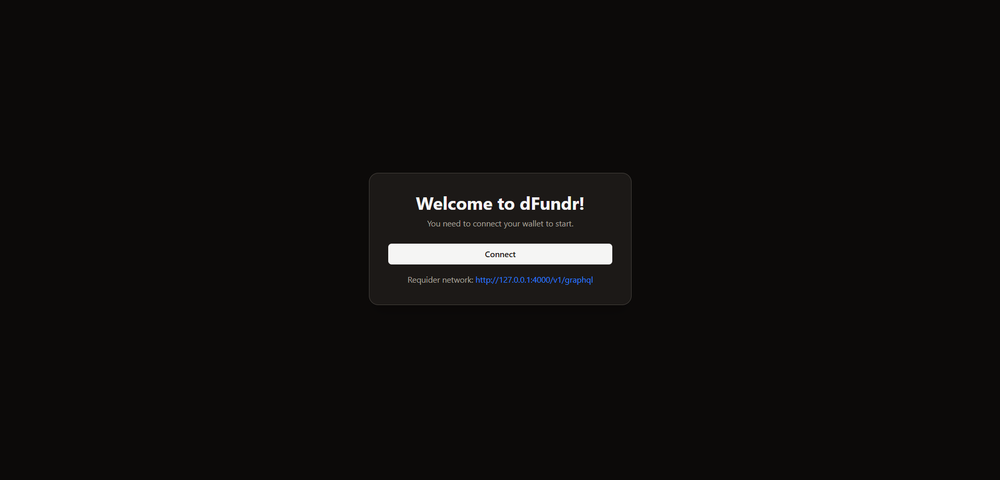
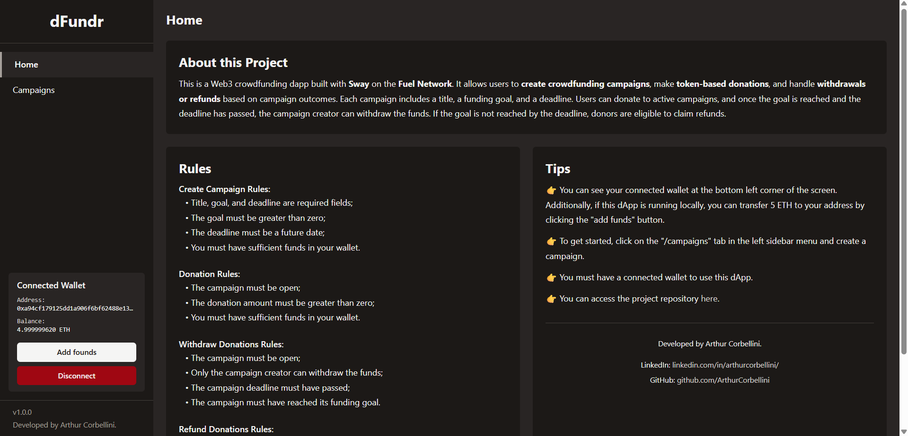
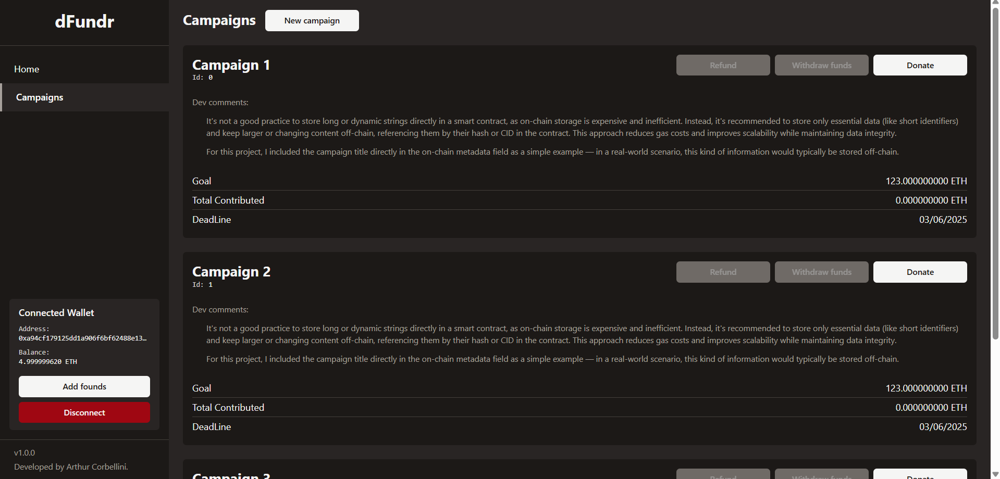

<div align="center">
  <h1>dFundr 💸</h1>
  <strong>Decentralized crowdfunding application (dApp) built on the Fuel Network.</strong>
</div>

## Overview
For this application, a smart contract was developed to simulate a crowdfunding platform. In it, project creators can launch fundraising campaigns, and users can contribute with tokens. Additionally, an interface was built to interact with the contract, allowing for campaign creation, donations, withdrawals, and refunds.

### Main Features
- Campaign creation with title, goal, and deadline.
- Donations based on ETH.
- Campaign creators can withdraw the funds if the goal is reached before the deadline.
- Donors can request a refund if the goal is not met by the deadline.

### Technologies Used
- **Sway** – Smart contract language on [Fuel Network](https://fuel.network/)
- **Fuel Network** – Modular blockchain for fast, scalable dApps
- **React** – Front-end user interface
- **TypeScript** – Type-safe JavaScript
- **pnpm** – Package manager

## Getting Started
These instructions will help you set up and run the project locally. To deploy to the testnet, see the [Deploying to Testnet](https://docs.fuel.network/docs/fuels-ts/creating-a-fuel-dapp/deploying-a-dapp-to-testnet/) guide.

### Prerequisites
- Node.js (version 22 or later);
- pnpm package manager;
- Fuel toolchain and Sway compiler (see [Fuel Docs](https://docs.fuel.network/guides/installation/#installing-the-fuel-toolchain-using-fuelup) for setup);
- Local wallet (see [here](https://docs.fuel.network/guides/installation/#setting-up-a-local-wallet) for instructions on setting up a new local wallet);
- To interact with the network, you’ll need to install a compatible wallet plugin. My suggestion is to use the [Fuel Wallet plugin](https://docs.fuel.network/docs/wallet/install/). See [Fuel Docs](https://docs.fuel.network/guides/user-quickstart/#setting-up-your-wallet).

### Installation
1. Install dependencies:
```
pnpm install
```
2. Start the Fuel dev server:
```
pnpm fuels:dev
```
3. Start the front-end development server.
```
pnpm dev
```
With that, the interface will be running at http://127.0.0.1:5173/.

*Note*: Your [Fuel Wallet](https://docs.fuel.network/docs/wallet/install/) must be connected to the same network as the application. If you followed the steps above correctly, switch your Fuel Wallet to the local network at http://127.0.0.1:4000/v1/graphql.

## How to Use
This dApp is composed of three main screens:
> Below each item are screenshots of the corresponding screens for reference.
1. **Wallet Connection**  
Users must connect their wallet to interact with the contract and perform transactions such as creating campaigns, donating, or requesting refunds.



2. **Home Page**  
A simple introduction explaining how the dApp works, its purpose, and what users can expect from the platform.



3. **Campaigns Page**  
Displays a list of all crowdfunding campaigns.  
  Users can:
    - Create new campaigns;
    - Donate to active campaigns;
    - Withdraw funds (if they are the creator and the goal is met before the deadline);
    - Request a refund (if the campaign does not reach its goal before the deadline).



## Rules
### Create Campaign Rules:
- Title, goal, and deadline are required fields;
- The goal must be greater than zero;
- The deadline must be a future date;
- You must have sufficient funds in your wallet.
### Donation Rules:
- The campaign must be open;
- The donation amount must be greater than zero;
- You must have sufficient funds in your wallet.
### Withdraw Donations Rules:
- The campaign must be open;
- Only the campaign creator can withdraw the funds;
- The campaign deadline must have passed;
- The campaign must have reached its funding goal.
### Refund Donations Rules:
- The campaign must be open;
- Only donors can request a refund;
- The campaign deadline must have passed;
- The campaign must **not** have reached its funding goal.

## Project Structure
### Back-end (On-chain)
Built with Sway on the Fuel Network, this part implements the crowdfunding logic via smart contracts. It manages campaign creation, donations, withdrawals, and refunds in a decentralized way.
```
crowdfunding-dapp
├── sway-programs
│   └── crowdfunding-contract
│       └── src/main.sw
└── README.md
```
### Front-end
A React and TypeScript web interface enabling users to create campaigns, donate, track goals, and request refunds.
```
crowdfunding-dapp
├── src/main.tsx
└── README.md
```

*Notes*:
- The [main.sw](./sway-programs/crowdfunding-contract/src/main.sw) file has been modularized into separate files to improve maintainability and ensure a clear separation of concerns.
- Communication between the interface and the smart contract is handled through a [Context Provider](./src/providers/campaign-provider.tsx), centralizing contract interactions and responsibilities in a single place. This approach keeps UI components lightweight and focused on presentation, rather than business logic.
- [Typography](./src/components/ui/my-typography.tsx) has been standardized to maintain visual consistency and improve readability throughout the application.

## Smart contract specification
For detailed information about the smart contract interface and behavior, see the [SPEC.md](./SPEC.md) file.

## Running Tests
To run the automated tests, use the following command:
```
cd sway-programs/
forc test
```

## Future Improvements
Here are some features and enhancements to improve the overall project quality and user experience:

- **Multilanguage Support**  
  Integrate a translation system to support multiple languages across the UI with [react-i18next](https://react.i18next.com/).

- **UI Component Library**  
  Implement a modern UI library such as [shadcn/ui](https://ui.shadcn.com/) or [Ant Design](https://ant.design/) for faster and more consistent front-end development.

- **Light & Dark Theme Toggle**  
  Add theme support so users can switch between light and dark modes.

- **Robust Form Validation**  
  Use [Zod](https://zod.dev/) to create more reliable and maintainable form validation schemas.

- **Smart Contract Portability**  
  Adapt the smart contract to support new tokens.

- **Funding Tiers**  
  Introduce contribution tiers (e.g. *Silver*, *Gold*, *Platinum*) with optional perks, badges, or unique descriptions for each level.  

- **Donor Rewards**  
  Based on the donation amount, users could receive NFTs, digital badges, or other types of rewards as recognition or utility.